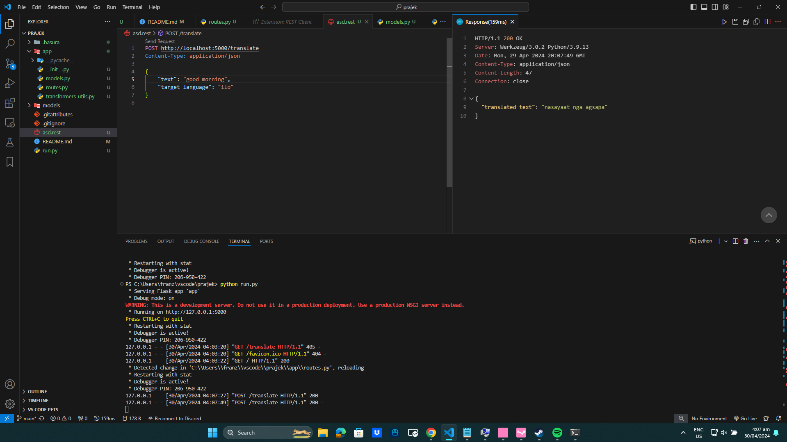

# bi translation app
```
 python -m pip install flask
 python -m pip install flask-cors
 ```

to run the flask API, go to project directory and type on terminal:
```
python run.py
```


 sample usage:

 

 ### API USAGE

```
POST http://localhost:5000/translate
Content-Type: application/json

{
    "text": "<TEXT TO BE TRANSLATED>",
    "target_language": "<TARGET LANGUAGE, EITHER "ilo" OR "en">"
}
```
-----
## Sample:
```
POST http://localhost:5000/translate
Content-Type: application/json

{
    "text": "good morning",
    "target_language": "ilo"
}
```

#### Sample HTTP response: 
```
HTTP/1.1 200 OK
Server: Werkzeug/3.0.2 Python/3.9.13
Date: Mon, 29 Apr 2024 20:20:39 GMT
Content-Type: application/json
Content-Length: 47
Connection: close

{
  "translated_text": "nasayaat nga agsapa"
}
```